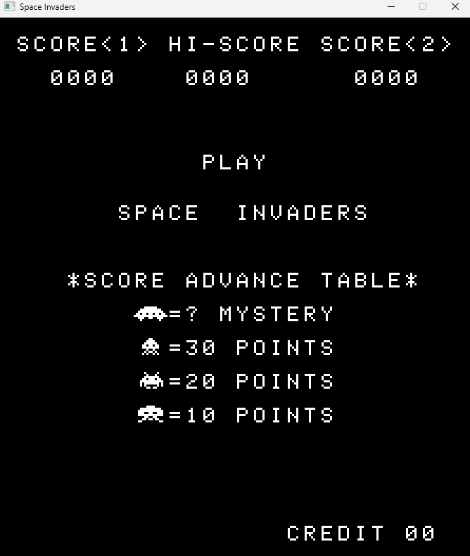

# Space Invaders

A Space Invaders emulator written in C++ using SDL2 for graphics rendering

  

# Features

- Nearly full Intel 8080 CPU emulation (~200 opcodes)
- Keyboard input (arrow keys + space bar control)
- Graphics rendering based on CPU interupts, similar to the old hardware
- Resolution scaling
